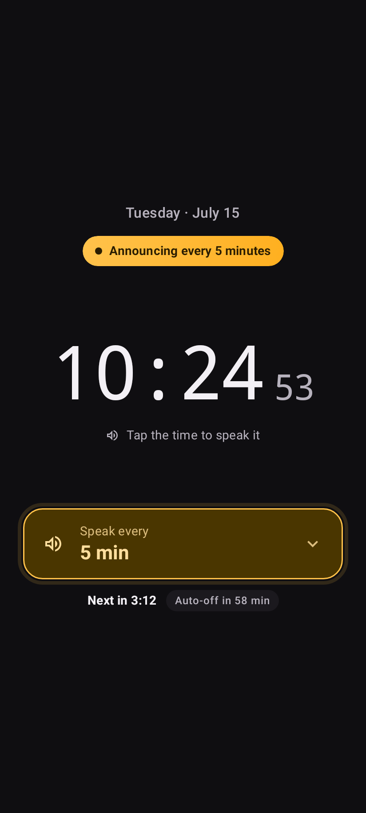
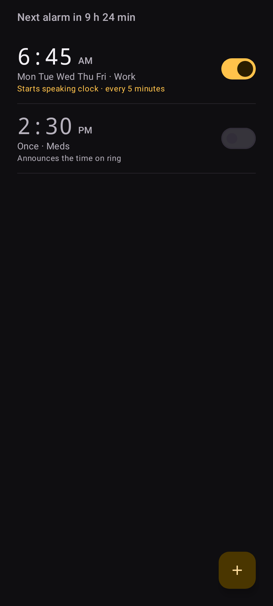
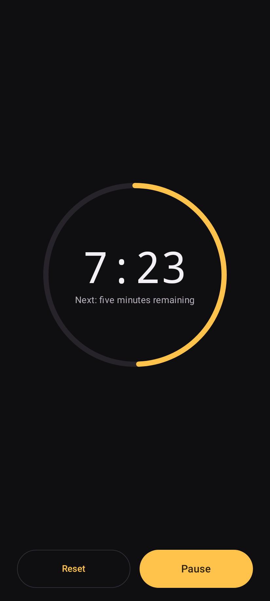
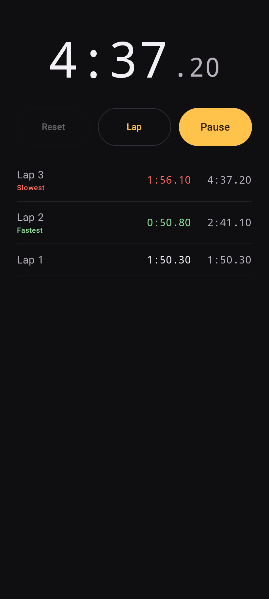

# Talking Clock (OSS)

A private, offline Android clock that speaks the time. It also includes talking
alarms, a talking timer, and a stopwatch—built first for people with time
blindness, ADHD, or memory issues.

> **Status: pre-release.** The four core tools work and are covered by automated
> tests. Real-device UX, background-reliability, and release-store checks are
> still in progress.

## Working features

- **Speaking clock:** tap to hear the time or announce it on aligned intervals
  from 15 seconds to 1 hour, including custom intervals and automatic shutoff.
- **Talking alarms:** one-shot or repeating alarms with labels, vibration,
  spoken time, snooze, and an optional handoff to the speaking clock after
  dismissal.
- **Talking timer:** remembers the last duration and announces milestones,
  final countdowns, pause/resume state, completion, and overtime.
- **Stopwatch:** live elapsed time, laps, and optional elapsed-time or lap
  announcements.
- **Offline speech:** system TTS or imported recorded voice packs, with clear
  setup guidance when a de-Googled phone has no TTS engine installed.
- **Display and behavior:** light, dark, and AMOLED themes; nightstand mode;
  quiet hours; adjustable speech style, rate, and pitch.
- **Private by construction:** no Internet permission, ads, trackers, accounts,
  analytics, location, or storage permission.

## Demo

These screenshots are generated by the UI test suite, so they track the app
rather than a separate mockup.

| Clock | Alarm |
|---|---|
|  |  |

| Timer | Stopwatch |
|---|---|
|  |  |

## Build and try it

Requirements: JDK 17 and Android SDK 35. Android Studio can install both.

```bash
git clone https://github.com/JohnJeffords/TalkingClock.git
cd TalkingClock
./gradlew assembleDebug
adb install -r app/build/outputs/apk/debug/app-debug.apk
```

On Windows, use `.\gradlew.bat assembleDebug`. To run the local test and lint
gate:

```bash
./gradlew testDebugUnitTest lintDebug verifyRoborazziDebug
```

After installation, tap the clock to test speech, choose an interval to see
background announcements, or start a short timer to hear its countdown.

## Project goals

- Publishable on F-Droid using only free and open-source dependencies and
  assets.
- First-class support for GrapheneOS, CalyxOS, and other de-Googled Android
  installations.
- Small APK and near-zero idle battery cost.
- An explicit, CI-guarded permission set with no Internet access.
- Readable code and documentation for new contributors.

## Documentation

- [Product design](docs/DESIGN.md)
- [Architecture and timekeeping rules](docs/ARCHITECTURE.md)
- [Testing and real-device checklist](docs/TESTING.md)
- [Voice-pack format](docs/VOICE_PACKS.md)
- [Publishing to F-Droid and Google Play](docs/PUBLISHING.md)
- [Decision log](docs/DECISIONS.md)
- [Contributor code style](docs/CODE_STYLE.md)

Maintainer and automation instructions remain in the repository, but are kept
out of the user-facing documentation path.

## License

Talking Clock is free software licensed under
[GPL-3.0-or-later](LICENSE). Third-party assets retain their own open-license
notices alongside their source metadata.
